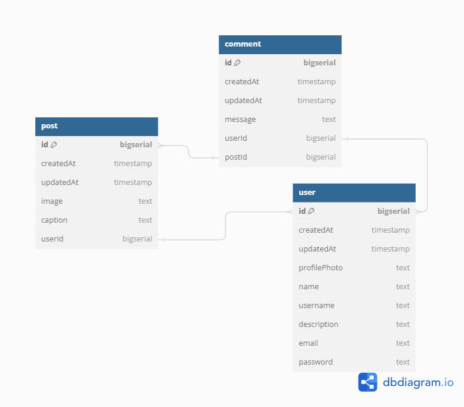

# Social Media API

The Social Media API provides endpoints for managing users, posts, and comments in a social media platform.

## Database Schema



## Getting Started

To get started with using the Social Media API, follow the steps below:

### Prerequisites

- Go programming language installed on your system.
- PostgreSQL database installed and running.

### Installation

1. Clone the repository:

   ```
   git clone <repository-url>
   ```

2. Install dependencies:

   ```
   go mod tidy
   ```

3. Build the project:

   ```
   go build
   ```

### Configuration

The API can be configured using environment variables or command-line flags. Available configurations are:

- `PORT`: Port on which the server will listen. Default is `8081`.
- `ENV`: Environment mode (`development`, `staging`, or `production`). Default is `development`.
- `DB_DSN`: PostgreSQL database connection string.

### Running the Server

Run the server using the following command:

```
go run .
```

## API Endpoints

The following endpoints are available in the API:

### Users

- `POST /api/v1/register`: Register a new user.
- `GET /api/v1/users`: Get all users.
- `GET /api/v1/users/{userId}`: Get a user by ID.
- `PUT /api/v1/users/{userId}`: Update a user by ID.
- `DELETE /api/v1/users/{userId}`: Delete a user by ID.

### Posts

- `POST /api/v1/posts`: Create a new post.
- `GET /api/v1/posts/{postId}`: Get a post by ID.
- `PUT /api/v1/posts/{postId}`: Update a post by ID.
- `DELETE /api/v1/posts/{postId}`: Delete a post by ID.

### Comments

- `POST /api/v1/comments`: Create a new comment.
- `GET /api/v1/comments/{commentId}`: Get a comment by ID.
- `PUT /api/v1/comments/{commentId}`: Update a comment by ID.
- `DELETE /api/v1/comments/{commentId}`: Delete a comment by ID.

## Error Handling

The API follows standard HTTP status codes for indicating the success or failure of a request. Error responses include appropriate error messages to help troubleshoot issues.

## Authentication

Authentication is not implemented in this version of the API. All endpoints are accessible without authentication.

## Features
Password hashing

## DB structure

```
Table user {
  id bigserial [pk]
  createdAt timestamp
  updatedAt timestamp
  profilePhoto text
  name text
  username text
  description text
  email text
  password text
}

Table post {
  id bigserial [pk]
  createdAt timestamp
  updatedAt timestamp
  image text
  caption text
  userId bigserial
}

Table comment {
  id bigserial [pk]
  createdAt timestamp
  updatedAt timestamp
  message text
  userId bigserial
  postId bigserial
}

Ref: post.userId < user.id
Ref: comment.userId < user.id
Ref: comment.postId < post.id
```
---

